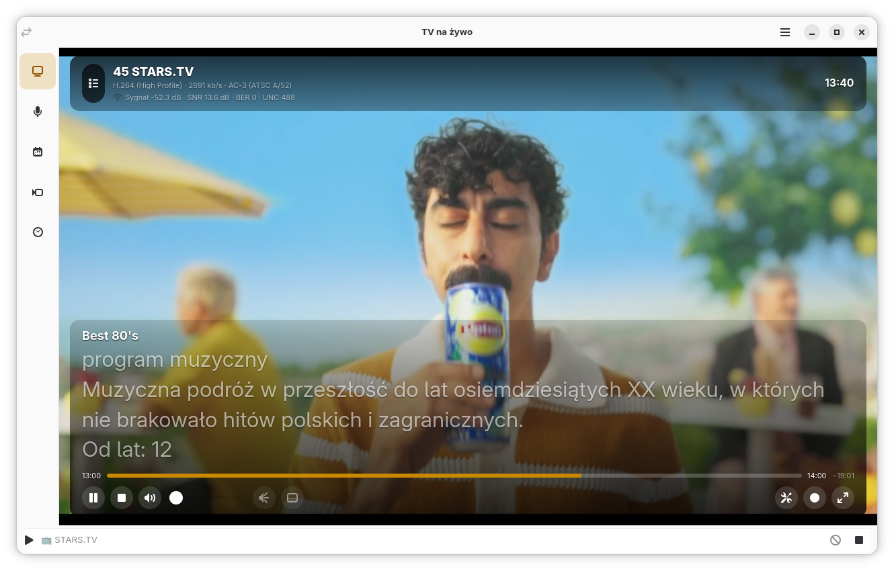
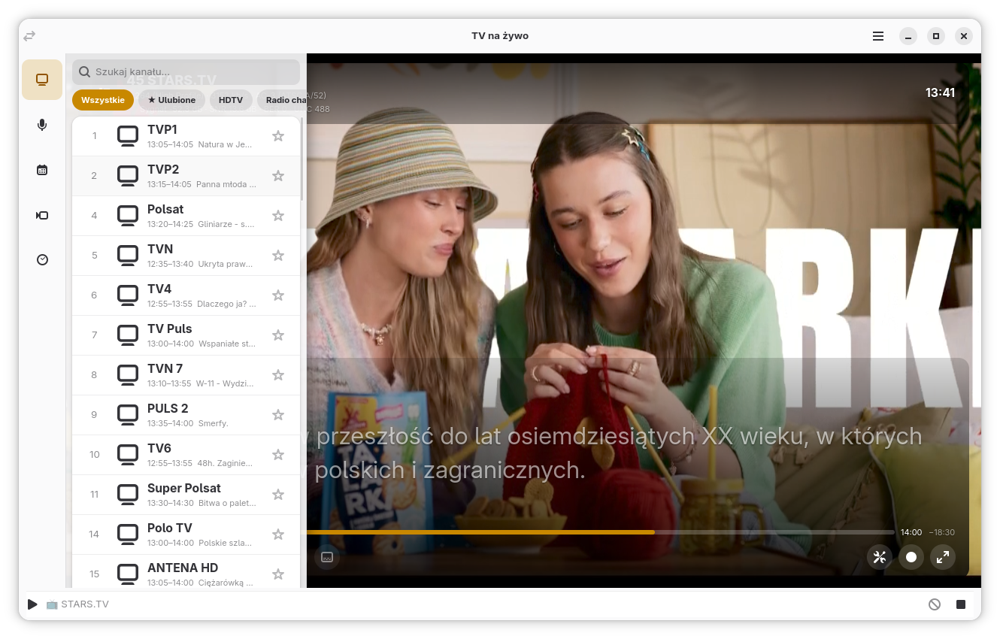
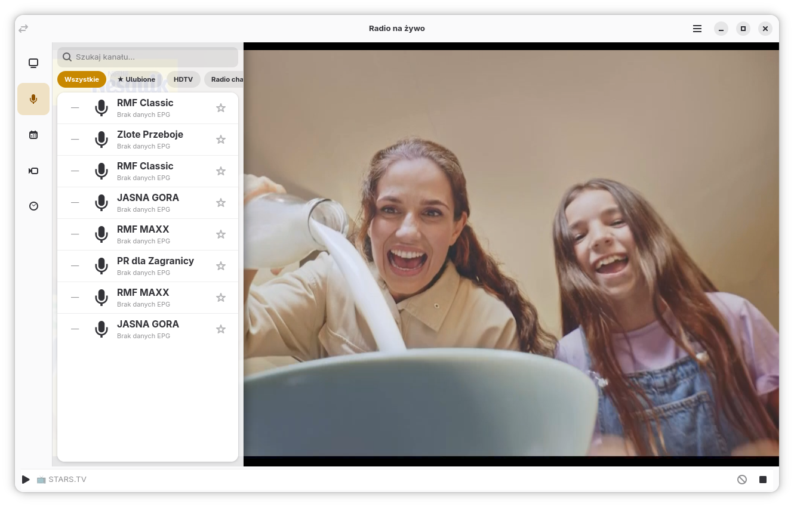
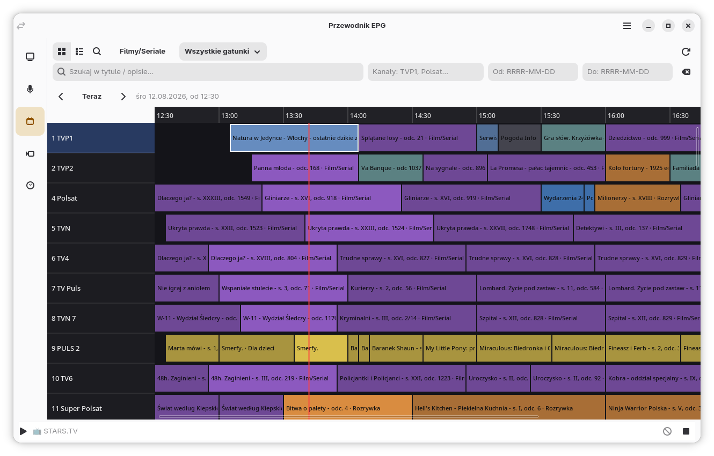
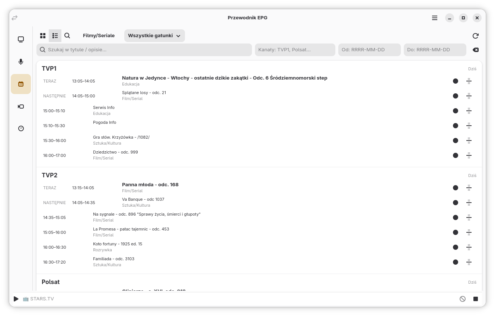
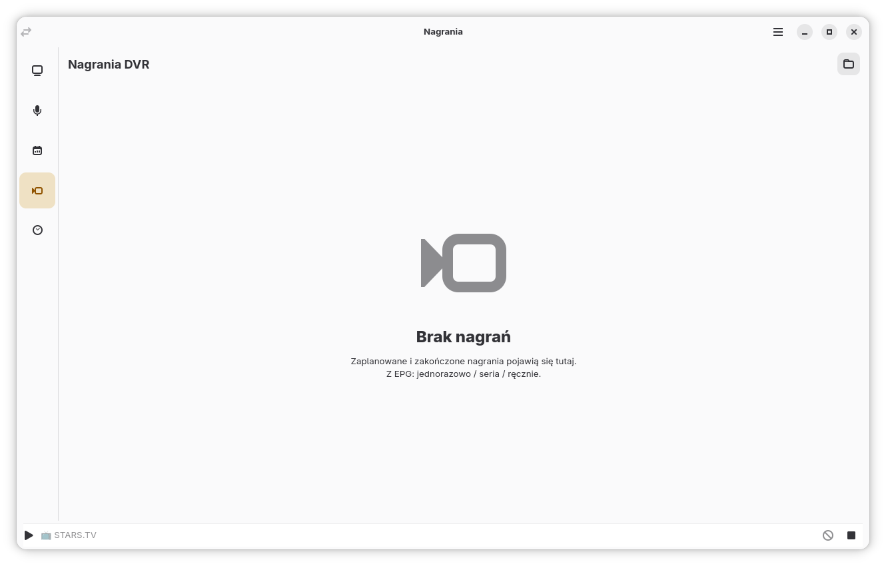
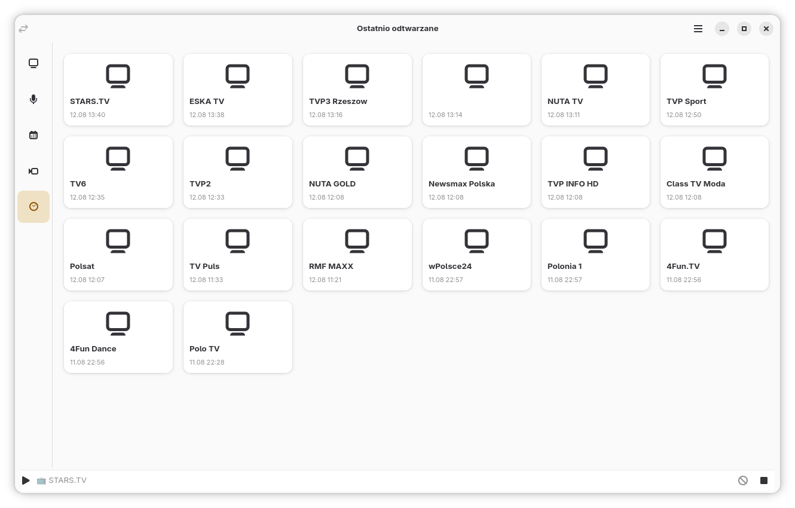
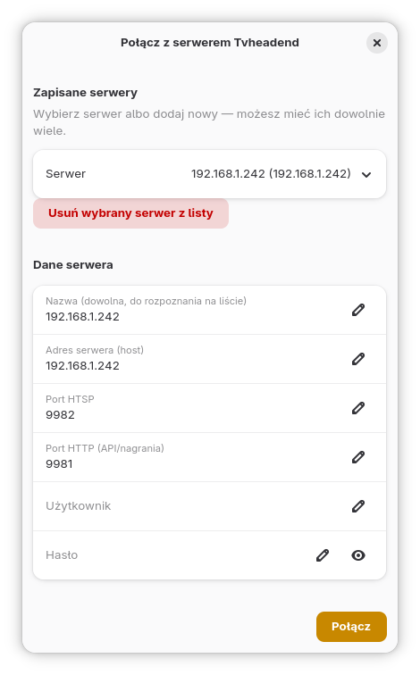
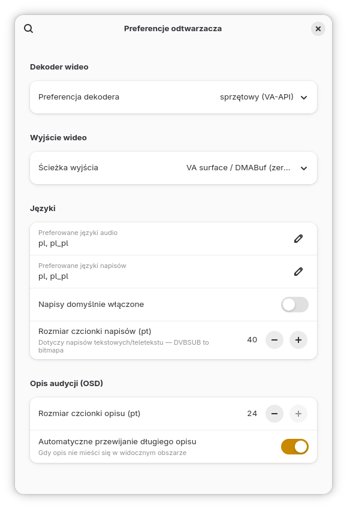

# TVHeadend GNOME Client

Klient Tvheadend dla GTK4 + libadwaita + GStreamer, mówiący natywnym
binarnym protokołem **HTSP** (nie REST) — z osobnymi trybami *TV na żywo*,
*Radio na żywo*, *Przewodnik EPG*, *Nagrania* oraz *Ostatnio odtwarzane*
(jak sekcje w Kodi/skórce Estuary), OSD z auto-hide, trybem pełnoekranowym,
wspólną belką statusu (mini-player) i integracją z appletem multimediów
GNOME przez MPRIS2.


## Zrzuty ekranu

### TV na żywo — OSD



### TV na żywo — lista kanałów



### Radio na żywo



### Przewodnik EPG — siatka



### Przewodnik EPG — lista



### Nagrania DVR



### Ostatnio odtwarzane



### Połączenie z serwerem



### Preferencje odtwarzacza



## Zależności systemowe (Fedora/Arch/Debian — nazwy pakietów mogą się różnić)

- GTK4 (>= 4.12) + libadwaita (>= 1.5)
- PyGObject (`python3-gobject` / `python-gobject`)
- GStreamer 1.22+ wraz z:
  - `gst-plugins-base`, `gst-plugins-good`, `gst-plugins-bad`, `gst-plugins-ugly`
  - `gst-plugin-gtk4` (dostarcza `gtk4paintablesink` — kluczowe dla renderu
    wideo bezpośrednio w drzewie widgetów GTK4/GSK, zero-copy na Waylandzie)
  - `gst-libav` (dekodery H.264/AAC/MPEG2 przez FFmpeg, jeśli nie masz
    sprzętowych/VAAPI)

Na ChimeraOS/Arch-based (AerynOS/Solus podobnie, sprawdź nazwy w repo):

```bash
sudo pacman -S gtk4 libadwaita python-gobject \
    gstreamer gst-plugins-base gst-plugins-good gst-plugins-bad \
    gst-plugins-ugly gst-libav gst-plugin-gtk4
```

Jeśli `gst-plugin-gtk4` nie jest spakietowany w Twojej dystrybucji, trzeba
zbudować go z `https://gitlab.freedesktop.org/gstreamer/gst-plugins-rs`
(pakiet `gtk4` w `video/gtk4`, Rust + `cargo-c`).

## Uruchomienie

```bash
pip install -r requirements.txt --break-system-packages
python3 main.py
```

Przy pierwszym uruchomieniu pojawi się okno połączenia — podaj adres
serwera Tvheadend, port HTSP (domyślnie 9982), login/hasło. Konfiguracja
zapisywana jest w `~/.config/tvh-gnome-client/config.json`.

## Przewodnik EPG

Tryb **Przewodnik EPG** oferuje trzy układy (przełącznik na pasku narzędzi):

| Układ | Opis |
|---|---|
| **Siatka** | Gazetka jak w Kodi/STB: kanały w pionie, oś czasu w poziomie, kolorowe kafelki audycji (gatunek DVB), zamrożony nagłówek godzin i kolumna nazw, 2D scroll przez wspólne `Gtk.Adjustment`. Linia „TERAZ”, kropka PVR, nawigacja strzałkami / Enter (odtwarzaj / nagraj). |
| **Lista** | Klasyczny widok „TERAZ + następne” per kanał z pełną datą/czasem i przyciskami PVR. |
| **Szukaj** | Płaska lista wyników wyszukiwania parametrycznego. |

### Wyszukiwanie parametryczne

Filtry działają lokalnie na cache EPG z HTSP (`eventAdd` / `eventUpdate`):

- **tekst** — tytuł, podtytuł, opis
- **Filmy/Seriale** — szybki przełącznik (`contentType` 0x1x)
- **gatunek** — dropdown kategorii głównych DVB (EN 300 468)
- **kanały** — nazwy oddzielone przecinkiem, dopasowanie częściowe (`TVP1, Polsat`)
- **zakres dat** — `Od` / `Do` w formacie `YYYY-MM-DD` (puste = całe EPG)

Przy aktywnym tekście widok automatycznie przełącza się na układ **Szukaj**.

Nawigacja klawiaturą / pilotem HID (gdy aktywny tryb EPG):

- ← / → — przesunięcie okna czasu o 30 min (siatka)
- ↑ / ↓ — zmiana zaznaczonego kanału
- Enter — audycja TERAZ → odtwarzaj; przyszła → przełącz nagrywanie
- Home — skok do „teraz”
- `g` / Guide — przejście do przewodnika

## Architektura

```
main.py
tvh/
  htsmsg.py           # binarna (de)serializacja HTSMSG
  client.py           # asyncio HtspClient: hello/auth/subscribe/DVR/EPG
  async_bridge.py     # most asyncio (HTSP) <-> GLib (GTK), wątek w tle
  library.py          # TvhLibrary(GObject) — stan: kanały/tagi/EPG/nagrania
  models.py           # dataclasses: Channel, ChannelTag, EpgEvent, Recording
  config.py           # zapis/odczyt konfiguracji połączenia
  genres.py           # contentType (DVB) → etykieta PL + kolor kafelka
  status_api.py       # HTTP JSON /api/status/inputs (siła sygnału w OSD)
player/
  gst_player.py       # appsrc/playbin3 → decodebin → gtk4paintablesink
  stream_controller.py # spina HTSP (ticket/muxpkt) z GstPlayer + preferencje
ui/
  app.py              # Adw.Application, ładowanie CSS
  window.py           # Adw.ApplicationWindow, szyna nawigacji, mini-player
  connection_dialog.py
  channel_list.py     # lista kanałów TV/Radio + filtr tagów/ulubionych
  live_view.py        # wideo + OSD (auto-hide) + fullscreen + pasek postępu EPG
  epg_view.py         # 3 układy EPG + wyszukiwanie parametryczne
  epg_grid_view.py    # shim kompatybilności → EpgGridWidget
  recordings_view.py  # lista nagrań DVR (stop/anuluj/usuń)
  recent_view.py      # kafelki „ostatnio odtwarzane”
  recent.py           # trwały magazyn historii (JSON)
  mpris.py            # serwis MPRIS2 dla appletu GNOME
  style.css           # akcenty na bazie zmiennych libadwaita
```

### Dlaczego appsrc, a nie zwykłe `uri=http://.../stream/channel/...`?

Zadanie było jednoznaczne: „korzysta z HTSP z pełnią dostępnych funkcji”.
HTSP dostarcza surowe pakiety (`muxpkt`) przez to samo połączenie TCP, na
którym leci sterowanie — nie ma tu adresu URL do podania `playbin`. Dlatego
pipeline to `appsrc` karmiony bajtami z `HtspClient.on_muxpkt`, a dalej
`decodebin` (autodetekcja kontenera/kodeków) rozdzielający się na gałąź
wideo (`gtk4paintablesink`) i audio (`autoaudiosink`).

Zaletą tego podejścia względem REST+HTTP (jak we `tvhplayer`) jest dostęp
do pełnego zestawu funkcji HTSP: `getTicket`, granularna kontrola DVR
(`addDvrEntry` z `configUUID`, `cancelDvrEntry` vs `stopDvrEntry` vs
`deleteDvrEntry`) i async EPG push (`eventAdd` / `eventUpdate` bez pollingu).

> **Uwaga (aktualność powyższego):** live TV faktycznie odtwarzane jest
> przez `getTicket` + zwykły HTTP MPEG-TS + `playbin3`
> (`StreamController.play_channel`), nie przez appsrc karmiony z
> `muxpkt` — ta zmiana przyszła później, przy naprawianiu stabilności
> VA-API/HEVC (patrz `player/gst_player.py`). appsrc zostaje jako ścieżka
> dla nagrań/fallbacku. W konsekwencji `signalStatus` z HTSP (wymaga
> aktywnej subskrypcji HTSP) nie nadchodzi dla live TV — siła sygnału DVB
> w OSD jest zamiast tego odpytywana przez HTTP JSON API
> `/api/status/inputs` (wymaga uprawnienia ADMIN na koncie), patrz
> `tvh/status_api.py`.

## Stabilność odbioru / strojenie buforowania

Odtwarzacz (`player/gst_player.py`) domyślnie priorytetyzuje stabilność nad
latencją: ~1.5 s bufora w kolejkach GStreamera, ~1.2 s prerollu przed startem
obrazu, renderowanie zsynchronizowane z zegarem pipeline’u (płynny pacing
klatek/audio) oraz watchdog, który wykrywa ciszę w danych i automatycznie
wraca do buforowania zamiast pozwolić obrazowi szarpać. Da się to przestroić
zmiennymi środowiskowymi:

| Zmienna | Domyślnie | Znaczenie |
|---|---|---|
| `TVH_BUFFER_MS` | `1500` | Rozmiar kolejek live (appsrc + queue) w ms |
| `TVH_PREROLL_MS` | `1200` | Ile danych (wg PTS) zebrać przed pierwszym PLAYING |
| `TVH_REBUFFER_MS` | `600` | Preroll po wykryciu zerwania strumienia (szybszy powrót) |
| `TVH_STALL_TIMEOUT_MS` | `700` | Po ilu ms ciszy watchdog uzna strumień za „zerwany” |
| `TVH_DISABLE_HW_HEVC` | `0` | `1` wyłącza sprzętowy dekoder HEVC (obejście buggy VA-API) |
| `TVH_ENABLE_HW_HEVC` | `0` | `1` wymusza sprzętowy HEVC (VA-API); domyślnie HEVC idzie softem |
| `TVH_HW_PROFILE_SWITCH_DELAY` | `0.4` | Opóźnienie (s) przy zmianie profilu sprzętowego dekodera |

Jeśli mimo większego bufora nadal widać zacięcia, warto sprawdzić logi pod
kątem `Brak danych ze strumienia przez` (watchdog re-bufferingu) — to znak,
że problem leży po stronie sieci/Tvheadend, a nie samego odtwarzacza.

## Znane ograniczenia / do dopracowania

- Detekcja „kanał radiowy vs TV” opiera się o obecność tagu z nazwą
  zawierającą „radio” — jeśli Twój serwer nie ma takiego tagu, warto dodać
  heurystykę po obecności/braku strumienia wideo w `subscriptionStart`
  (pole `streams[].type`).
- Wyszukiwanie EPG jest lokalne po cache HTSP; przy bardzo dużych bazach
  można uzupełnić o serwerowe `epgQuery`.
- Siatka EPG w OSD fullscreen (kompaktowy `EpgGridWidget`) nie jest jeszcze
  podpięta pod klawisz Guide w trybie live — sama klasa jest gotowa
  (`compact=True`).
- Tray icon (StatusNotifierItem) celowo pominięty — na czystym GNOME i tak
  wymaga rozszerzenia powłoki; zamiast tego jest MPRIS2 (quick settings /
  OSD GNOME bez dodatków).
- `gst4paintablesink` bywa nazwany `gtk4paintablesink` w zależności od
  wersji `gst-plugins-rs` — jeśli `Gst.ElementFactory.make` zwraca `None`,
  sprawdź `gst-inspect-1.0 | grep -i gtk4`.
